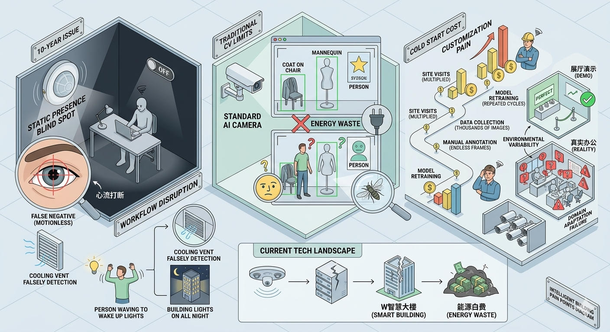
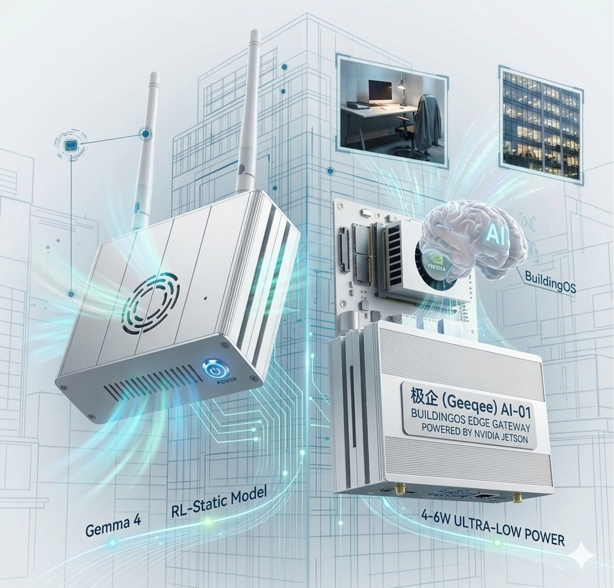
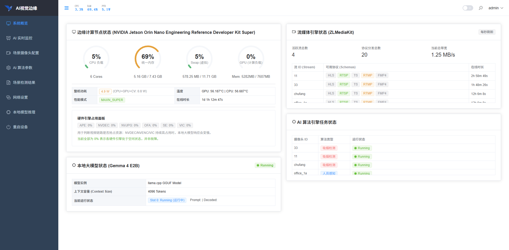
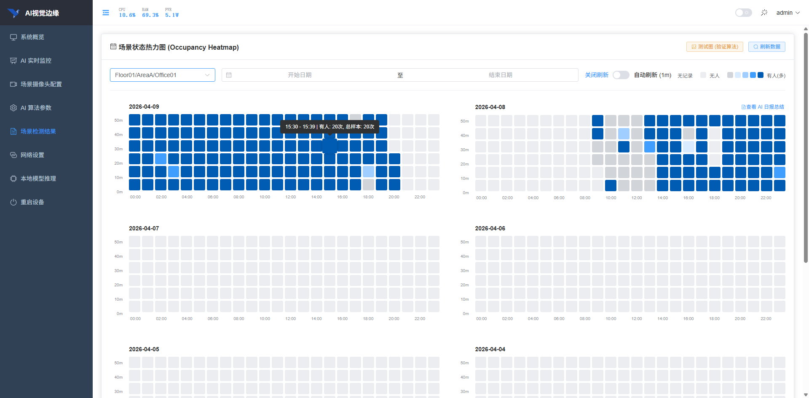
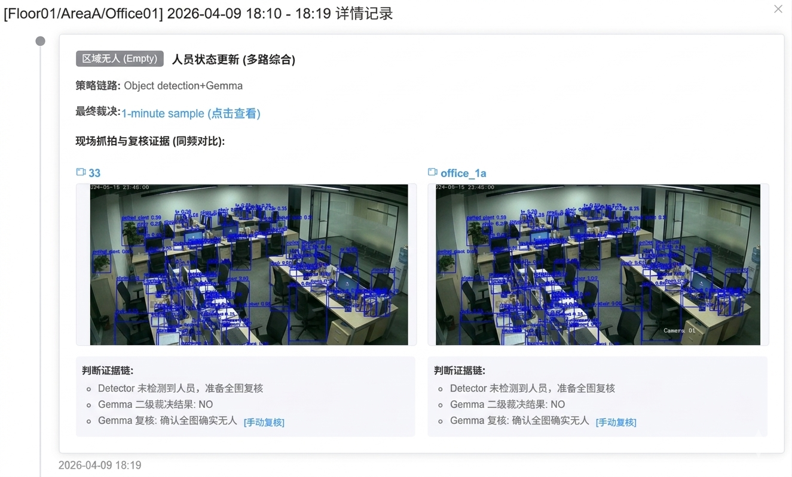
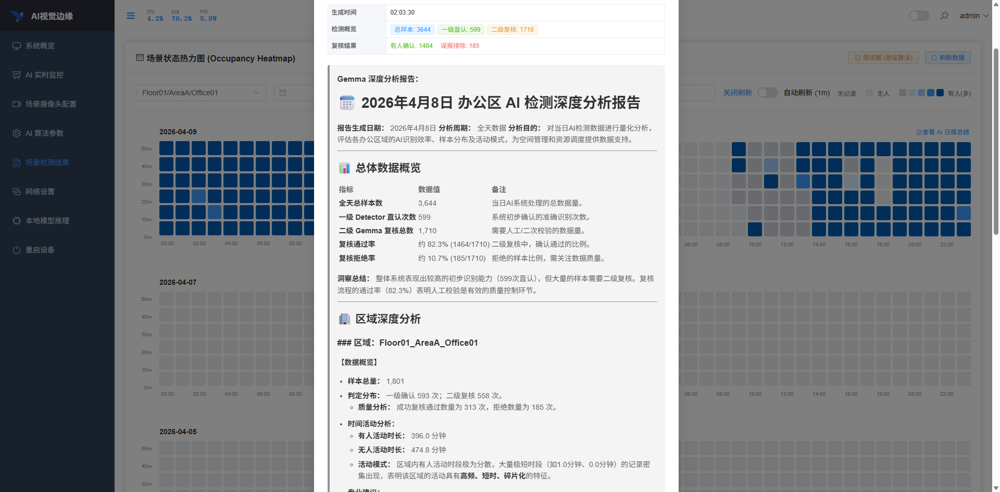
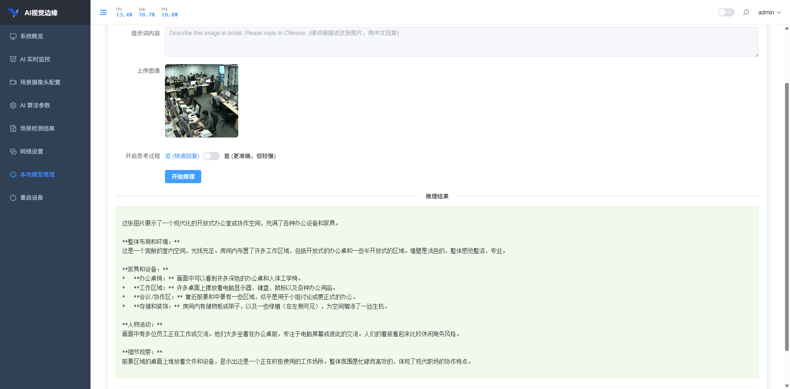
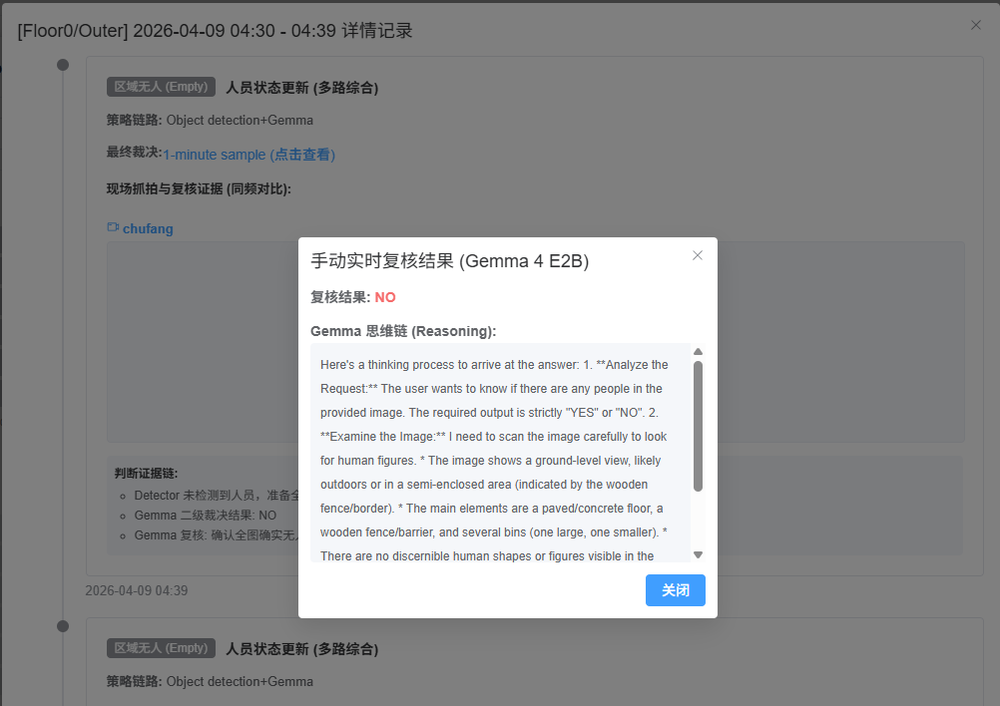
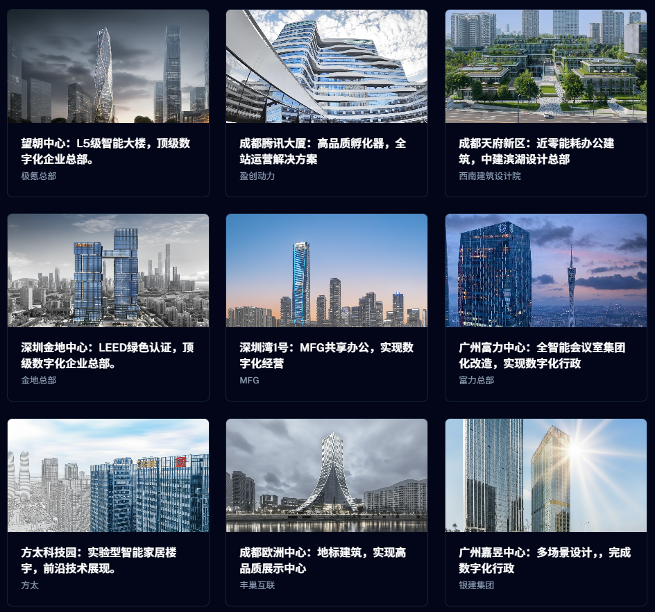

# 🏢 办公节能“变天”了！极企首发 4-6W 极致功耗 AI 盒子，让写字楼告别“伪智能”

### 01 ⏳ 十年深耕的“最后 1 公里”：我们在等一个“大脑”

在智能建筑与楼宇自动化行业，有一个长期存在却鲜少被公开讨论的秘密：过去十年间，那些被包装得天花乱坠的“自动感应”、“智慧照明”与“自适应空调系统”，在绝大多数真实办公场景中，其实一直处于一种令人极其抓狂的“半残”状态。行业内充斥着大量打着“人工智能”与“物联网”旗号，实则只能执行死板逻辑的设备。作为深耕智能大楼领域整整十年的团队，极企（Geeqee）曾无数次在深夜的写字楼里进行现场勘测与系统调试。我们陪伴着这个行业从早期的简单继电器自动化，一路走向基于传感器的物联网繁荣，但也比任何人都更深刻地体会到，当前主流技术路线那几乎无法逾越的致命痛点。

首先，是红外传感器（PIR）的“盲区”与“智障”表现。PIR 传感器是目前大楼里最普遍、成本最低的感应设备，它的工作原理简单粗暴——依靠检测环境中移动的热源来判断是否有人。在走廊、洗手间等人员处于持续运动状态的过序空间，PIR 表现得差强人意。然而，现代办公场景的核心是“静坐”。程序员盯着屏幕写代码、财务人员核对报表、设计师构思方案，往往一坐就是几个小时纹丝不动。结果就是：只要加班的人在工位上保持静止超过设定时间（通常是 15 到 30 分钟），系统就会判定该区域“无人”，随后头顶的灯光会“啪”地一声突然熄灭。在无数个深夜，努力加班的员工不得不在黑暗中无奈地站起身来，像做早操一样大幅度挥舞手臂，甚至需要离开座位走动，才能重新“唤醒”灯光。这种极其糟糕的用户体验，不仅打断了员工的心流，更让所谓的“智能”沦为笑柄。更糟糕的是，PIR 极其容易受到环境热扰动的影响。夏天空调出风口吹出的冷风、窗外阳光照射导致的局部温差变化，甚至是一只偶尔飞过的大型飞虫，都常常被 PIR 传感器误认为是“人体移动”。这导致了空调和照明系统在空无一人的会议室或办公区里彻夜空转，造成了极其惊人且隐蔽的能源浪费。

为了解决红外传感器的“盲区”问题，行业在过去几年开始大规模引入计算机视觉（CV）技术，特别是基于深度学习的目标检测模型（如经典的 YOLO 架构）。摄像头确实能“看”到人了，只要画面里有人体的轮廓，算法就能框出来并保持设备运转。但这又引入了第二个更为致命的痛点：传统视觉的“笨拙”与“死板”。这些模型本质上只是在做像素层面的特征匹配，它们只能识别“形状”，却完全无法理解“场景”背后的真实语义。对于传统的 AI 来说，它没有人类的“常识”。一件搭在人体工学椅背上的黑色大衣、一个摆在工位上的大型人形抱枕、甚至是一张印着明星代言人的等身海报，在摄像头的二维像素特征里，和“一个坐着的人”极其相似。传统视觉算法会极其固执地认为那里“坐着一个人”，从而向中央控制系统发送“有人”的指令，让灯光和空调持续运转数十个小时。这种因为“视觉误报”导致的能源浪费，比 PIR 的误报更加隐蔽，也更难以通过简单的规则来消除。

更让人感到绝望的，是传统 AI 方案那极其昂贵的“冷启动”与“定制化”成本。许多客户抱怨，为什么在展厅里演示得完美无缺的 AI 摄像头，一装到自己的公司就彻底“水土不服”？原因在于每个公司的办公环境都是独一无二的。不同的工位挡板高度、不同的地毯纹理、不同的反光玻璃、甚至是不同的灯光色温，都会对依赖像素特征的传统小模型造成毁灭性打击。为了解决这些在新环境中层出不穷的漏报和误报，工程团队不得不付出巨大的代价：他们需要派人到现场重新采集数千甚至上万张真实场景的照片，然后交由人工标注团队进行枯燥乏味的“画框”标注，最后再重新训练、微调模型并进行 OTA 升级。这种“千人千面”的极高定制化成本，让原本旨在帮助企业“省钱”的 AI 节能方案，变成了一项入不敷出的“奢侈品”。很多项目在交付验收后，因为办公环境的一点小改变（比如换了一批新椅子）就频繁报错，维护成本高昂，最终只能被物业默默拔掉电源，沦为天花板上的昂贵摆设。

极企这十年，其实一直在苦苦等待。我们知道单靠优化算法结构或增加训练数据，无法从根本上跨越这道鸿沟。我们需要的，不是一个只能认框的“机器眼睛”，而是一个真正具备“人类常识理解力”的“大脑”。这个大脑需要能够像人类保安一样思考：它需要知道衣服搭在椅子上不是活人，雕像不是活人，海报上的人也不是真正的人；它还需要在员工被两台大显示器遮挡得只露出半个额头时，依然能通过周围的键盘、水杯和微小的动作上下文，推理出“那里确实有一个正在工作的人”。更为苛刻的是，出于对企业商业机密和员工隐私的绝对保护，这个“大脑”绝不能将任何办公区域的实时视频或截图上传到云端处理，它必须能够完全离线、驻留在边缘侧（Edge）的微型计算盒子里运行。

这听起来像是一个不可能完成的任务，直到 2026 年 4 月 2 日，Google 正式开源了专为边缘设备打造的视觉多模态大模型——**Gemma 4 E2B**。这不仅是一次简单的模型版本迭代，更是整个智能建筑与 AIoT 行业的一个历史性分水岭。我们敏锐地意识到，那个能够彻底终结办公楼宇“伪智能”时代、跨越“最后 1 公里”的奇点，终于到来了。Gemma 4 E2B 带来的“零样本（Zero-Shot）泛化能力”和“深层语义推理能力”，让我们第一次拥有了在边缘侧赋予设备“常识”的武器。

------------------

### 02 🏛️ 战略风口：边缘智能体（Agent）的“国家队”入场

极企的技术突围，并非孤军奋战，而是顺应了国家产业升级的宏大叙事。

近日，工信部等部门印发了\*\*《推动物联网产业创新发展行动方案（2026—2028年）》\*\*，这份重磅文件为整个智能行业指明了最终航向：

- **明确要求**：推动人工智能大模型在**终端和边缘的轻量化部署**，协同提升资源调度能力。这意味着，未来的 AI 不应仅仅高高在上地待在云端机房，而必须下沉到生产和生活的每一个边缘节点。
- **核心目标**：打造一批具备**自主感知、控制与执行能力**的先进智能体（Agent）。不再是简单的“指令-执行”，而是要求设备具备理解环境并自主决策的能力。

这份方案标志着 AIoT 已经从传统的“万物互联”进化到了“万物智能”的新阶段。极企 BuildingOS 团队凭借敏锐的行业嗅觉，在政策发布的第一时间，便率先实现了多模态大模型在边缘硬件上的真正落地。这不仅体现了“中国速度”，更是对国家产业战略的精准响应，证明了我们在智能建筑垂直领域的深厚积累。

***

### 03 🛠️ 极致工程学：在 8GB 显存里跳一场“戴着镣铐的舞”

在发布会上谈论大模型总是令人兴奋的，但在真实的边缘计算工程现场，现实却极其残酷。有了强大的 Gemma 4 E2B 大模型，绝不代表着你就能直接把它塞进大楼的弱电井里并让它顺利工作。在云端机房，你可以肆无忌惮地调用动辄几百 GB 显存的 H100 阵列；但在写字楼的实际部署中，我们面对的计算节点往往是 NVIDIA Jetson Orin Nano 这样极其廉价、体积只有一个巴掌大小的边缘计算盒子。更要命的是，它只有区区 8GB 的统一内存（显存与系统内存共享）。

在这个逼仄的 8GB 空间里，你不仅要维持操作系统、网络代理和基础服务的基本运转，还要同时跑起用于多路视频流高频扫描的视觉初筛模型，最后还要塞进一个庞大的 Gemma 4 多模态大模型。这就像是在一条狭窄的单行道上，同时强行开进两辆满载的重型卡车，稍有不慎，就会引发严重的内存溢出（OOM）导致整个系统彻底崩溃。此外，还有一道极其严苛的物理红线悬在头顶：功耗。市面上许多动辄宣称几十 TOPS 算力的边缘 AI 盒子，满载运行时功耗惊人，发热严重。对于一个旨在“节能”的系统来说，如果 AI 盒子本身消耗的电费比它帮大楼省下的空调和照明电费还要多，那这种产品在商业逻辑上就是彻底的“耍流氓”。

面对这种看似无解的死局，极企的底层工程团队展现出了近乎偏执的技术底蕴。我们没有选择向硬件妥协去推销更昂贵的设备，而是通过一系列“断腕式”的底层架构重构，硬生生在这个 8GB 的空间里压榨出了极限的性能。这是一场名副其实的“戴着镣铐的舞蹈”。

**第一重构：双轨制架构 (Dual-Track Architecture) 的精妙接力**
我们清醒地认识到，用大模型去实时逐帧分析多路监控视频是极其愚蠢且不现实的。为此，我们独创了“YOLO26m 高频初筛 + Gemma 4 深度复核”的双轨制协同架构。在流水线的前端，我们部署了极度轻量化、并经过 TensorRT 极限加速的微型 YOLO 模型（或 RL 静态图模型）。它充当着不知疲倦的“哨兵”，以极高的帧率和极低的功耗对所有视频流进行实时扫描。绝大多数情况下，“哨兵”就能准确判断出明显的移动人员。只有当“哨兵”遇到难以分辨的模棱两可情况（例如：置信度低于阈值的疑似人体、被严重遮挡的轮廓、或者极其类似人体的静物如椅背大衣）时，系统才会触发“拦截机制”，将那一帧高清画面截取下来，精准投递给作为“最高指挥官”的 Gemma 4 E2B 进行深度语义复核。这种架构将昂贵的大模型调用频率从“每秒数十次”断崖式地降低到了“每小时几次”，让 8GB 的边缘盒子能够轻松应对复杂并发场景，从根本上解决了算力瓶颈。

**第二重构：“即用即毁”的极端显存管理机制**
大模型在推理时，不仅仅消耗加载模型权重的静态显存，更可怕的是它在处理上下文时会动态生成庞大的 Context Slots（上下文缓存）。在多轮推理后，这些缓存如果不加干预，会像黑洞一样迅速吞噬掉设备仅剩的几百兆内存，最终引发系统崩溃。为了解决这个边缘端的致命难题，我们抛弃了常规的常驻会话模式，设计了一套极其极端的“即用即毁”显存释放机制。
在极企的系统中，Gemma 4 被设定为“无记忆”的单次任务执行者。在每次 Gemma 4 完成单张图片的语义复核并输出最终的 YES/NO 结论后，系统不会保留任何会话状态或历史关联。相反，我们的后端代码会立即通过 HTTP 接口，直接向底层的 `llama.cpp` 服务发送一个硬性的 `DELETE` 请求至 `/slots/0` 端点。这就像是特工电影里的“阅后即焚”，强制要求底层引擎立刻、彻底地清空刚才为推理分配的所有上下文缓存。这种微操级别的显存管理，确保了每一次大模型调用结束后，系统的可用显存都能瞬间反弹回干净的基线状态，彻底斩断了任何可能的显存碎片化累积或隐性泄漏风险。

**第三重构：底层序列化解析与秒级自愈的容错网络**
在 Jetson 这样的 ARM 架构统一内存平台上，底层内存的管理极其脆弱。我们发现在高并发读取 RTSP 视频流（OpenCV）、Python 频繁触发垃圾回收，以及底层 PyCUDA/TensorRT 异步释放显存这三者同时发生时，极易产生底层竞争，引发 `double free or corruption (out)` 这种极其棘手的 C++ 级别内核崩溃。
为了攻克这一难题，我们一方面抛弃了容易引发内存泄漏的第三方冗余封装，直接深入底层规范了 TensorRT Engine 的序列化与加载逻辑（例如专门处理 YOLO 导出的 magicTag 元数据头，避免解析异常）；另一方面，我们接受了“边缘端硬件在极限压力下必然存在偶发崩溃”的现实，并以此为基础构建了强大的自愈网络。我们通过深度定制 Docker 的 `restart: always` 策略，配合健康检查探针，构建了秒级的自动容错恢复机制。即使系统在极端压力下触发了统一内存抖动导致进程崩溃，守护程序也能在 3 到 5 秒内无感重启核心引擎，迅速恢复视频流拉取和推理任务。对于边缘端应用而言，这种高可用性的容错表现，远比追求一个永不崩溃的理想模型更具工程价值。

**最终成果的经济学意义：4-6W 的极限功耗**
通过这套挑战极限的工程学重构，极企实现了在 Jetson Orin Nano 8GB 设备上，双推理引擎（视觉初筛 + 多模态复核）常态化运转下的奇迹——整个 AI 盒子的整机运行功耗被牢牢死锁在 **4-6W** 的极致水平。
这意味着什么？这意味着这台 24 小时监控大楼、掌控着照明和空调命脉的“超级大脑”，一整天的耗电量还不到 0.15 度（约合人民币 1 毛钱）。相较于它通过精准识别空房间而为企业省下的每月成千上万的电费，AI 自身的能耗成本几乎可以忽略不计。极企用最底层的代码压榨，把省下的每一度电，都变成了客户实实在在的利润。

***

### 04 🏭 实际运行：极企 BuildingOS Web Manager 的核心功能解密

极企不仅仅交付一个冷冰冰的算法模型或一台黑盒硬件，我们交付的是一套完整的、所见即所得的边缘端智能操作系统——**BuildingOS Web Manager**。这套系统通过现代化的 Web 前端界面，让高深的 AI 技术变得触手可及、透明且可被验证。管理人员只需通过浏览器，即可全面掌控整栋大楼的智能化脉络。

在实际运行中，BuildingOS Web Manager 提供了以下几个核心功能模块：

**1. 全景 Dashboard 与硬件引擎实时监控 (AI Monitor)**
登录系统的首个界面，是一个极具科技感与数据密度的全景仪表盘。它不仅实时展示边缘节点的 CPU 负载、GPU 负载、统一内存（Unified Memory）和 Swap 交换区的使用率，还独创了“硬件引擎占用面板”。管理人员可以清晰地看到底层 NVDEC（视频解码器）、NVENC（视频编码器）等硬件单元的实时状态。系统内置了智能预警机制：当统一内存超过 90% 导致大模型推理可能延迟，或者 Swap 出现剧烈抖动时，顶部会立刻弹出醒目的警告提示。同时，Dashboard 实时汇总显示当前拉取的 RTSP 视频流数量、AI 任务并发数以及 Gemma 本地大模型的运行状态（Idle/Running），让设备的健康状况一目了然。

**2. 场景状态热力图 (Occupancy Heatmap)**
这是彻底颠覆传统红外感应器管理方式的核心可视化界面。系统以时间轴为基准（X轴为一天中的 24 小时，Y轴为每小时的分钟片段），绘制出所选区域全天的“人员存在热力图”。网格的颜色采用了深浅不一的 Element Plus 主题蓝色系：深蓝色代表该分钟内检测到人员频繁活动，浅灰色则代表无人，而空白则代表无日志记录。管理人员只需瞥一眼，就能直观地掌握某个会议室或开放办公区在一天内的真实使用频率与人员潮汐规律。这背后是 AI 引擎每分钟一次的高频采样与融合判断，为后续调整空调时段和照明策略提供了最权威的数据支撑。

**3. 极致透明的“判断证据链” (Decision Chain)**
传统的 AI 产品往往是一个“黑盒”，用户只知道结果，却不知道为什么。BuildingOS 打破了这种不信任。在热力图的每一个时间节点详情中，系统会展示极其详尽的“判断证据链”。每一次状态更新，系统不仅留存现场抓拍的高清图片作为证据，还会把 AI 的多级决策过程逐条列出：

- **一级初筛**：例如“Detector 漏报”或“Detector 发现疑似人员”。
- **二级复核**：如果触发了大模型，系统会明确显示“Gemma 复核：Detector 漏报，但 Gemma 在全图中发现了人员”或“Gemma 确认画面为空”。
  这种将 AI 的内部判断逻辑白盒化、透明化的设计，极大地增强了物业管理人员对系统的信任度。

**4. 实时单图推理验证与“手动复测”功能**
我们深知，让客户信服的最好方式就是“眼见为实”。

- **本地大模型智能生成的“每日空间深度分析报告”**：
  除了实时单帧图像推理，边缘盒子里的 Gemma 4 大模型还兼任着大楼的“首席数据分析师”。每天深夜，系统会自动将全天产生的数千条枯燥检测数据（包括 L1 初筛直认次数、L2 Gemma 复核的通过与拒绝率、各区域的驻留时长等）打包，直接喂给完全本地离线运行的 Gemma 大模型进行深度总结分析。
  凭借其强大的自然语言与逻辑推理能力，大模型能够根据这些结构化数据，自动撰写出一份逻辑严密、洞察深刻的《办公区 AI 检测深度分析报告》。例如，在某日系统自动生成的报告中，Gemma 不仅精准统计了“全天总样本 3644 次，二级复核通过率约 82.3%”，更做出了极具专业水准的业务指导：它敏锐地指出 `Floor0_Outer` 与 `Floor_CF` 区域“一级直认次数极低（分别为0次和6次）但复核全部通过”，建议工程团队将这些区域列为模型校准的重点；同时它总结出 `Office01` 区域的活动呈现“高频、短时、碎片化”特征，并提示需要关注该区域的异常拒绝样本质量。这种**完全由边缘本地大模型智能生成、具备专业视角的运营总结报告**，让冷冰冰的统计数字瞬间转化为可执行的商业决策，真正实现了从“视觉感知”到“运营管理”的跨越。
  

- **独立推理沙盒**：系统中专门开辟了“本地模型推理”功能页，支持用户上传任意现场图片，选择内置的“人体存在检测”或“吸烟行为检测”提示词模板，一键调用设备本地的 Gemma 4 进行实时推理，并在右侧直接展示输出结果。

- **无缝的手动复测**：在历史日志的证据链中，当管理人员对某次 AI 的判定存疑时，只需点击旁边附带的\*\*\[手动复测]**按钮。前端会立刻提取当时保存的原始高清原图（不带任何干扰框），通过后端的 API 重新发送给 Gemma 进行一次完全独立的实时推理。最令人惊艳的是，复测结果的弹窗中不仅会给出 YES/NO 的最终结论，还会完整呈现 Gemma 的**“思维链 (Reasoning Process)”\*\*。例如，你可以直接看到大模型的内部思考过程：*“我正在扫描画面。左侧有一件黑色的衣服搭在椅子上，虽然轮廓类似人体，但我没有观察到头部或肢体特征。右侧工位空无一人。因此，结论是 NO。”*
  这种可视化的逻辑推演，让 AI 不再是冷冰冰的代码，而是一个真正能够讲出道理的“智能助理”。

***

### 05 🚀 极企情怀：做智能建筑场景下的“最强者”

作为一家推崇 **“Solopreneur（独角兽式个体）”** 文化的技术驱动型公司，极企科技始终相信：专注与极致，是战胜平庸的唯一武器。

我们坚持“技术+场景”双轮驱动的理念，十年如一日地深耕建筑空间。当整个行业还在盲目追逐云端千亿参数大模型的噱头时，我们已经通过极致的底层工程能力，把最前沿的多模态 AI 塞进了写字楼里那一个个只有巴掌大小、功耗不足 6W 的盒子里。

**极企 BuildingOS 的愿景很简单：让每一座大楼都拥有自己真正的灵魂，让每一盏灯、每一台空调，都能“懂”那个努力奋斗的加班人。**

**办公楼宇的视觉革命，从今天，正式开始。**
