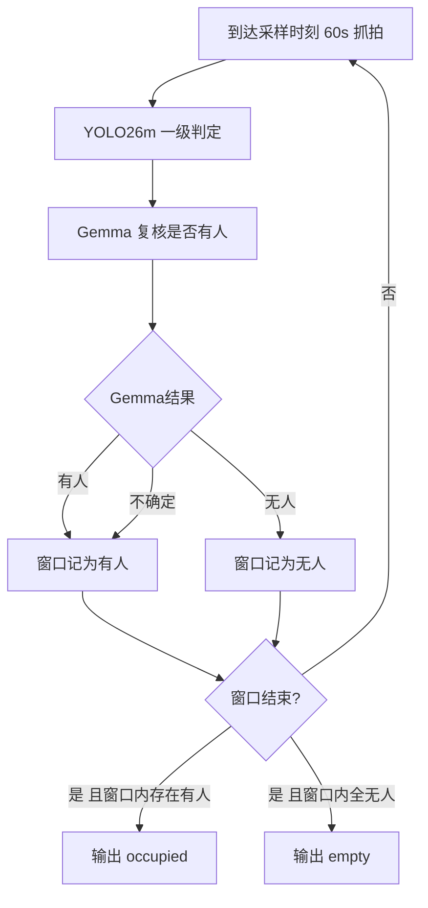
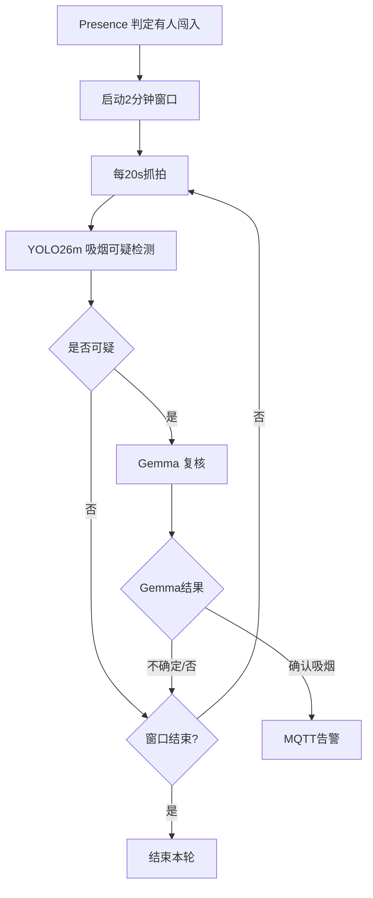

# YOLO26m + Gemma(E2B) 综合判定逻辑设计文档

## 1. 文档目标与范围

本文档定义办公空间“人员存在感知”和“吸烟检测”两条业务链路在 **YOLO26m + Gemma(E2B)** 组合下的完整判定逻辑。

目标是：
- 在不依赖客户现场训练数据的前提下，使用通用模型与二级复核能力提升可靠性。
- 将“是否有人”“是否吸烟”从单帧检测升级为**时间窗口 + 多次综合判断**。
- 支撑“谨慎关灯（避免误关）”与“节能优先（避免误亮）”两类相反目标在不同时段自动切换。

不在本文档范围：
- 训练数据制作与模型训练流程。
- 具体代码实现细节（函数级实现、类设计）。

---

## 2. 已有基础与设计前提

### 2.1 已具备环境
- YOLO 推理链路可运行，支持 TensorRT `.engine`。
- Gemma(E2B) 本地服务可用于图片复核。
- MQTT 告警链路已接入。
- 系统可按时间间隔采样截图进行判定。

### 2.2 模型策略
- Presence（人员存在）：YOLO26m（通用权重）+ Gemma 复核。
- Smoking（吸烟行为）：YOLO26m（通用权重）+ Gemma 复核。
- 最终告警均以 Gemma 复核结果为准，YOLO 作为一级召回器。

### 2.3 关键原则
- **宁可多一次复核，不做单帧直接结论。**
- **时段策略优先于统一阈值。**
- **上班时段防误关灯；深夜时段防误亮灯。**

---

## 3. 总体架构（双阶段）

### 3.1 一级判定：YOLO26m
用于快速筛选候选事件：
- Presence：当前采样帧是否存在“人”。
- Smoking：当前采样帧是否出现“可疑吸烟行为”。

### 3.2 二级判定：Gemma(E2B)
用于语义复核与误报抑制：
- Presence：确认“是否有人”、人所处位置（前景/远端工位）。
- Smoking：确认是否为真实吸烟而非“吃东西/拿笔/遮挡动作”。

### 3.3 最终输出
- Presence 最终状态：`有人` / `无人`。
- Smoking 最终状态：`未发现吸烟` / `确认吸烟告警`。
- 输出通过 MQTT 发布，并附带置信信息与复核摘要。

### 3.4 采样定义（强制）
- Presence：`每 60 秒抓拍 1 张图片`做一次综合判定（可配置）。
- Smoking：在“有人闯入后”的小窗口内，`每 20 秒抓拍 1 张图片`做一次综合判定（可配置）。
- 本设计为**图片采样推理**，不是 20 秒连续视频流推理。
- 多摄像头同时到点采样时，Gemma 可能出现排队，需启用复核门控与队列削峰。

---

## 4. Presence（人员存在）判定逻辑

> 业务本质：高机位、近远景混合，远端小目标易漏检。照明控制对“误判无人”非常敏感。

### 4.1 时间窗口总则
- 默认最大时间窗口：`10 分钟`（可配置）。
- 在最大时间窗口内，以固定采样间隔（建议 `60s`，可配置）执行“YOLO + Gemma 综合判定”。
- 只有当**整个窗口持续综合判断为无人**，才输出“无人”。

### 4.2 分时段策略

#### A. 上班时段（默认工作日 09:00-19:00，可配置）
- 策略目标：避免误关灯。
- 判定策略：
  - 窗口保持 `10 分钟`。
  - 必须连续 `10 分钟`综合无人，才推送“无人”。
- 容错倾向：允许少量“漏判有人”被后续采样修正，不急于关灯。

#### B. 加班时段（默认 19:00-23:00，可配置）
- 策略目标：人数稀疏条件下降低漏检风险。
- 判定策略：
  - 最大时间窗口拉长到 `15 分钟`（可配置）。
  - 必须连续 `15 分钟`综合无人，才推送“无人”。
- 原因：远端零散人员更易漏检，需要更长观察窗口。

#### C. 无人上班时段（默认 23:00-06:00，可配置）
- 策略目标：节能优先，防止“误判有人导致不关灯”。
- 判定策略：
  - 最大时间窗口缩短为 `5 分钟`（可配置）。
  - 连续 `5 分钟`综合无人即推送“无人”。
- 原因：该时段先验概率“无人”高，应提高关灯灵敏度。

### 4.3 Presence 综合判定流程

单次采样（每分钟）流程：
1. 抓拍当前帧。
2. YOLO26m 做 presence 一级判定（人框候选）。
3. 将原图 + 关键 ROI（远端区域优先）送 Gemma 复核“是否有人”（强制步骤）。
4. 生成本次综合结果：`has_person = true/false`。
5. 写入当前窗口序列。

窗口收敛规则：
- 若窗口内任一次 `has_person=true`：窗口状态记为“有人持续”，不输出无人。
- 仅当窗口内全部采样均为 `false`：输出“无人”。

时段边界规则：
- 当一个窗口跨越时段边界（如 18:59 启动跨到 19:00）时，窗口策略按“窗口启动时刻所属时段”固定，不中途切换。
- 新窗口再按新时段策略计算，避免同一窗口内阈值漂移。

---

## 5. Smoking（吸烟）判定逻辑

> 业务本质：过道场景，大部分时间无人；只有“有人闯入后”才有吸烟检测价值。

### 5.1 启动门控（Presence 触发）
- 默认平时不跑吸烟检测主流程。
- 当 Presence 判定“有人闯入”后，启动吸烟检测小窗口。

### 5.2 小时间窗口
- 默认 `2 分钟`（可配置）。
- 在该窗口内先验证“持续有人”：
  - 若窗口内持续有人，才进入吸烟检测采样。
  - 若人员快速离开，则结束窗口，不做吸烟判定。

### 5.3 吸烟检测采样
- 采样间隔默认 `20 秒`（可配置）。
- 每次采样流程：
  1. YOLO26m 进行吸烟可疑行为一级检测。
  2. 若 YOLO 触发可疑事件，调用 Gemma(E2B) 复核。
  3. Gemma 返回“确认吸烟/不成立/不确定”。

### 5.4 告警发布规则
- 仅当 Gemma 明确“确认吸烟”时发布 MQTT 告警。
- 若 Gemma 为“不确定”，继续下一采样轮，不立即告警。
- 若窗口结束均未确认吸烟，输出“本轮无吸烟告警”。

### 5.5 Gemma 复核门控与排队策略（强制）
- 由于多摄像头可能同秒采样，Gemma 复核必须经过队列，不直接并发打满。
- 必须采用独立复核队列：默认并发 `1`，上限 `2`。
- Presence 复核触发优先级（从高到低）：
  1. YOLO 判定“无人”（防误关灯）
  2. YOLO 边界低置信样本
  3. 远端小框样本
- Smoking 复核触发：仅在 YOLO 命中可疑吸烟事件时触发。
- Gemma 结果处理：
  - Presence：`不确定`按“有人”处理（保守，不关灯）。
  - Smoking：`不确定`不告警，进入下一采样轮。

---

## 6. 状态机定义

### 6.1 Presence 状态机
- `IDLE`：等待下一次分钟级采样。
- `WINDOW_TRACKING`：窗口内持续采样与综合判定。
- `CONFIRM_OCCUPIED`：窗口内出现任意“有人”。
- `CONFIRM_EMPTY`：窗口内连续综合无人达到时段阈值。

状态迁移关键：
- `IDLE -> WINDOW_TRACKING`：到达采样时刻。
- `WINDOW_TRACKING -> CONFIRM_OCCUPIED`：任意采样综合有人。
- `WINDOW_TRACKING -> CONFIRM_EMPTY`：连续综合无人达到窗口长度。
- `CONFIRM_* -> IDLE`：发布结果后进入下一轮。

### 6.2 Smoking 状态机
- `SMOKE_IDLE`：无人时关闭吸烟检测。
- `SMOKE_WINDOW_ACTIVE`：有人闯入后激活 2 分钟窗口。
- `SMOKE_YOLO_STAGE`：按 20s 采样进行一级检测。
- `SMOKE_GEMMA_REVIEW`：可疑样本送 Gemma 复核。
- `SMOKE_ALERT`：确认吸烟后发布告警。

---

## 7. 强制规则（实施基线）

### 7.1 时段跨界规则（强制）
- 当一个窗口跨越时段边界时，必须按“窗口启动时刻所属时段”执行完整窗口，不得中途切换。
- 仅允许在下一窗口开始时切换时段策略。

### 7.2 Gemma 不确定结果处理（强制）
- Presence：Gemma 返回 `不确定` 时，必须按“有人”处理。
- Smoking：Gemma 返回 `不确定` 时，必须按“不告警、继续下一采样轮”处理。
- 任何单帧 `不确定` 结果不得直接触发 MQTT 告警。

### 7.3 MQTT 冷却与去重规则（强制）
- Presence 与 Smoking 必须实现事件去重键：`area/camera + eventType + windowId`。
- 同类事件在冷却窗口内不得重复推送。
- 默认冷却值：
  - Presence：`180s`
  - Smoking：`180s`

### 7.4 生产初值推荐表（强制默认）

| 参数键 | 默认值 | 说明 |
| :--- | :--- | :--- |
| `presence_window_default_minutes` | `10` | 工作时段无人判定窗口 |
| `presence_window_overtime_minutes` | `15` | 加班时段无人判定窗口 |
| `presence_window_night_minutes` | `5` | 夜间无人判定窗口（节能优先） |
| `presence_sample_interval_seconds` | `60` | Presence 抓拍间隔 |
| `worktime_range` | `09:00-19:00` | 工作时段 |
| `overtime_range` | `19:00-23:00` | 加班时段 |
| `night_range` | `23:00-06:00` | 夜间时段 |
| `smoke_window_minutes` | `2` | 吸烟检测小窗口 |
| `smoke_sample_interval_seconds` | `20` | Smoking 抓拍间隔 |
| `smoke_require_presence_continuous` | `true` | 仅在持续有人时启用吸烟检测 |
| `gemma_presence_review_enabled` | `true` | Presence 启用 Gemma 复核 |
| `gemma_smoke_review_enabled` | `true` | Smoking 启用 Gemma 复核 |
| `gemma_review_queue_concurrency` | `1` | Gemma 复核并发（可上调到2） |
| `gemma_presence_cooldown_seconds` | `60` | Presence 复核冷却 |
| `gemma_smoke_cooldown_seconds` | `20` | Smoking 复核冷却 |
| `mqtt_alert_cooldown_seconds` | `180` | MQTT 同类事件冷却 |

---

## 8. MQTT 输出规范

### 8.1 Presence 主题建议
- 主题：`buildingos/presence/result`
- 字段建议：
  - `areaCode`
  - `result` (`occupied`/`empty`)
  - `windowMinutes`
  - `timePeriod` (`worktime`/`overtime`/`night`)
  - `source` (`yolo26m+gemma`)
  - `timestamp`

### 8.2 Smoking 主题建议
- 主题：`buildingos/smoking/alert`
- 字段建议：
  - `cameraId`
  - `result` (`confirmed_smoking`)
  - `windowMinutes`
  - `sampleIntervalSeconds`
  - `source` (`yolo26m+gemma`)
  - `evidenceImageUrl`
  - `timestamp`

### 8.3 去重与冷却（强制）
- Presence 与 Smoking 告警都必须设置事件去重键（`area/camera + eventType + windowId`）。
- 同类告警在冷却时间内不得重复推送。

---

## 9. 流程图版（Mermaid）

### 9.1 Presence 综合判定流程

### 9.2 Smoking 综合判定流程

---

## 10. 运行与运维建议

- Presence 与 Smoking 都采用“采样 + 时间窗口”后，单次推理延迟不是核心瓶颈，优先保证稳定性与一致性。
- 长期观测指标：
  - 误关灯率（工作时段）
  - 误亮灯率（夜间时段）
  - 吸烟误报率（Gemma 复核前后对比）
- 若误关灯仍偏高：优先延长对应时段窗口，而不是盲目调高阈值。
- 若夜间误亮灯偏高：优先缩短夜间窗口并强化 Gemma “无人复核”提示词。

---

## 11. 实施结论

在当前“不可使用客户现场数据训练、以通用模型为主”的约束下，采用 **YOLO26m + Gemma(E2B)** 的双阶段综合判定是可行方案：

- Presence：通过分时段窗口策略降低误关灯风险。
- Smoking：通过“有人触发 + 间隔采样 + Gemma确认”降低误报。
- 最终效果由“时间策略 + 二级复核”保证，而非依赖单帧检测。

---

## 12. 代码实现详细设计 (附录)

基于本设计文档，系统在 `ai_engine/src/` 目录下落地了完全解耦的三层架构代码，彻底摒弃了臃肿的 `ultralytics` 依赖与低效的连续视频流推理。以下是各核心模块的设计说明：

### 12.1 核心主控程序 (`main.py`)
**定位**：系统的大脑中枢，负责串联底层驱动、状态机与消息队列。
**核心机制**：
- **间隔采样替代视频流**：不再采用 25fps 逐帧推理，而是维护一个主循环，严格按照配置的时间间隔（如 Presence 60秒，Smoking 20秒）主动从 RTSP 流中抓取最新一帧。
- **MQTT 去重与冷却**：实现了 `publish_mqtt_event` 函数，使用 `areaCode_camId_eventType` 作为去重键，并强制应用 180 秒的发送冷却期，避免系统抖动时疯狂发送重复告警。
- **ZLM 动态流代理**：独立线程启动时自动调用 ZLMediaKit API 进行 RTSP 流代理注册，实现配置驱动的零干预拉流。

### 12.2 底层推理引擎 (`yolo_infer.py`)
**定位**：极速、轻量的一级召回驱动。
**核心机制**：
- **原生 Ultralytics 引擎加载**：为解决 YOLOv8 导出 `.engine` 时头部附加 JSON metadata 导致底层 C++ API 报错 `magicTag failed` 的问题，系统采用了 Ultralytics 原生的 `YOLO(engine_path, task=...)` 加载方式。
- **TensorRT 硬件加速**：虽然使用了 Ultralytics 顶层封装，但底层依然会自动调用 TensorRT 进行 GPU 满血加速推理，兼顾了极高的开发鲁棒性与推理性能。
- **动态结果解析**：内置了针对检测（Detect）和姿态（Pose）两种模型输出结构的统一解析逻辑，向上层屏蔽了底层张量维度的差异。

### 12.3 状态机业务大脑 (`state_machine.py`)
**定位**：时间窗口与时段策略的落地实现。
**核心机制**：
- **`PresenceStateMachine`**：
  - 动态根据系统时间获取当前时段（`worktime`, `overtime`, `night`）。
  - 在窗口期内，只要有任意一次“有人”判定，即锁定为 `CONFIRM_OCCUPIED`；只有窗口内全部采样均为“无人”，才在窗口结束时收敛为 `CONFIRM_EMPTY`。
- **`SmokingStateMachine`**：
  - 默认休眠，仅暴露 `trigger_presence()` 接口。当 Presence 确认有人时，激活 2 分钟的吸烟检测小窗口。
  - 窗口期满或人员离开即自动销毁，节省算力。

### 12.4 大模型复核队列 (`gemma_queue.py`)
**定位**：并发控制与 Gemma API 交互防雪崩组件。
**核心机制**：
- **单例优先级队列**：使用 `PriorityQueue` 严格控制并发数（默认 `concurrency=1`），防止多个摄像头同时请求导致 Jetson 内存溢出。YOLO 低置信度（防误关灯）的 Presence 任务具有最高优先级。
- **超时降级策略**：若任务在队列中积压超过 30 秒，或 Gemma 响应超过 15 秒，系统自动执行安全降级（Presence 默认返回 `YES` 保持亮灯，Smoking 返回 `UNKNOWN` 不告警）。
- **主动缓存释放**：每次调用结束后，无论成功失败，主动向 `http://127.0.0.1:8080/slots/0` 发送 `DELETE` 请求，释放 llama.cpp 的上下文缓存，防止长期运行导致 OOM。

